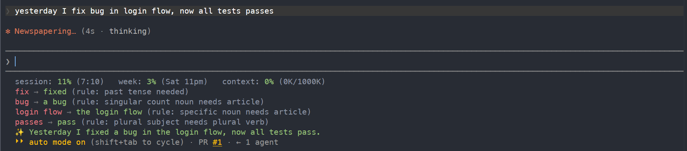
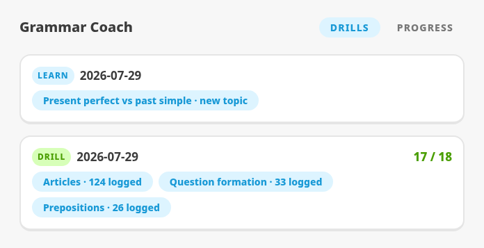
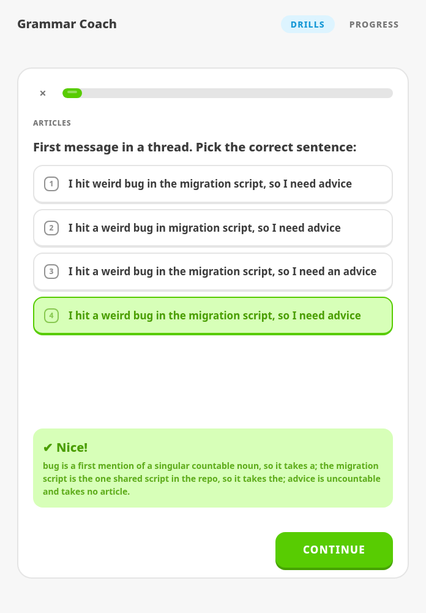
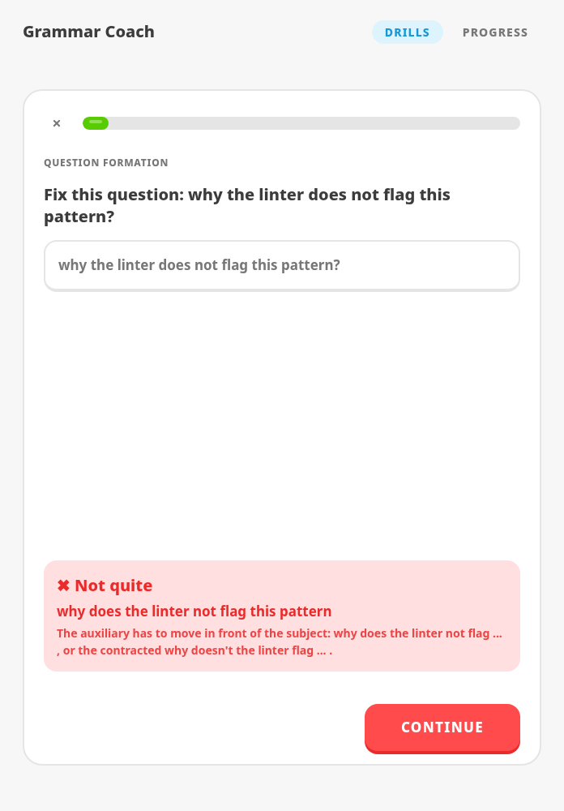
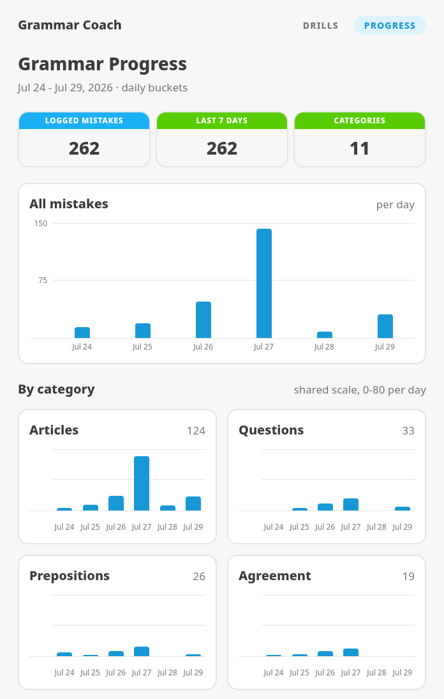

# cc-grammar-coach

An English grammar coach for Claude Code, in two parts:

- a **checker** hook that reviews every English message you send, out of band, logs the mistakes it finds, and shows short feedback in your statusline;
- a local **dashboard** fed by that log, where the **drill**, **learn**, and **progress** skills do their work: drill practices your logged mistakes, learn teaches the next topic from a weekly syllabus, progress charts your mistake frequency by category over time.

## The checker



The checker runs on every message automatically: it reviews the message, appends any mistakes to the log the drill practices from, and - if the statusline is wired - shows one of:

- `✔ Looks good` - clean message, one short compliment.
- `<wrong> → <fix> (<rule>: <why>)` - one line per grammar error.
- `✨ <rephrase>` - a more natural rewrite of the whole message: offered after the error lines when the fixes alone would not make it read natively, or alone - in place of the praise - when the message is grammatically correct but phrased in a way no native would use; the `rephrase` setting turns this line off.

## The dashboard

Lessons, quizzes, and the progress chart are views of one local web app. Start it whenever you want it - no skill involved, nothing running in the background until you ask:

```
GRAMMAR_HOME="${GRAMMAR_HOME:-$HOME/.claude/cc-grammar-coach}"
python3 "$GRAMMAR_HOME/dashboard/server.py"
```

It opens your browser at `http://127.0.0.1:8437/` and serves until you press Ctrl+C or close the terminal - there is no daemon and no autostart. Running it again while it is already up just reopens the tab. Set `GRAMMAR_DASHBOARD_PORT` if 8437 is taken. The drill, learn, and progress skills launch this same command, so a skill invocation and your own launch land on the same dashboard. The path is stable across plugin updates: the checker hook refreshes that copy of the app on the first message of a session, which is also when it first appears after install.



The server binds `127.0.0.1` only and rejects requests that do not address it as localhost, so the dashboard is reachable from your machine and nowhere else. It is a local server rather than a file you can double-click: the pages need it running, because they read your live mistake log and record your quiz results as you go.

## Drill and learn

Ask in plain language ("give me a grammar drill", "quiz me on my mistakes", "let's learn a new grammar topic"), or invoke the skills explicitly:

```
/cc-grammar-coach:drill
/cc-grammar-coach:learn
```

**Drill** ranks your recent weak spots from the mistake log and builds a lesson plus quiz per topic, drawn from your own logged mistakes. **Learn** teaches the next new topic from the weekly syllabus, one per week. Either way the skill writes the session into the dashboard and opens it there, explaining each answer by contrast with your native language when one is configured. Every session stays in the list, so you can reread a lesson or retake its quiz later, and each attempt's score is kept. The quiz is fully keyboard-driven: number keys or arrow keys pick an answer, Enter checks it, Esc returns to the lessons and again to the session list.

<p align="center">
  
  
</p>

## Progress

```
/cc-grammar-coach:progress
```

**Progress** opens the dashboard's chart view - a column chart of all mistakes plus a small-multiple panel per category - so you can see which weak spots are shrinking. It is computed from the mistake log every time the page loads, so it is never a stale snapshot. Counts are raw flagged mistakes: a day with more written English naturally shows more of them.



## Requirements

- `bash`, `python3`, and `curl`.
- An OpenAI-compatible chat-completions endpoint for the grammar model.
- Linux or macOS.

## Install

In Claude Code, add this repository as a plugin marketplace and install the plugin:

```
/plugin marketplace add butvinm/cc-grammar-coach
/plugin install cc-grammar-coach@cc-grammar-coach
```

Then optionally wire grammar feedback into your statusline:

```
/cc-grammar-coach:configure install-statusline
```

It proposes either configuring a new statusline or integrating the grammar segment into your existing one; details and manual wiring: [docs/statusline.md](docs/statusline.md).

## Configuration

On install, Claude Code prompts you for these settings; change them later from the `/plugin` menu.

The checker flags only the error categories you have enabled. The default selection covers the core grammar categories (articles, agreement, tense, prepositions, and so on); more are defined in the catalog but start disabled - word order, pronouns, comparatives, phrasal-verb particles, possessives, and a narrow punctuation category. To review and change your selection with evidence from your own mistake log, run:

```
/cc-grammar-coach:configure mistake-categories
```

Details in [docs/mistake-categories.md](docs/mistake-categories.md).

| Field             | Type               | Default               | Meaning                                                                                                                                       |
| ----------------- | ------------------ | --------------------- | --------------------------------------------------------------------------------------------------------------------------------------------- |
| `native_language` | string             | _(none)_              | Drill and learn use it to explain English by contrast with your first language; empty means generic lessons. Not read by the checker.         |
| `rephrase`        | boolean            | `true`                | Allow the checker to append one `✨` rephrase line for clearly awkward messages.                                                              |
| `llm_base_url`    | string             | _(none)_              | OpenAI-compatible endpoint base URL including the version segment, e.g. `https://your-host/v1`; required, the checker is inactive without it. |
| `llm_model`       | string             | `openai/gpt-oss-120b` | Model id sent to the endpoint.                                                                                                                |
| `llm_api_key`     | string (sensitive) | _(none)_              | Bearer key for the endpoint; stored outside `settings.json`.                                                                                  |

## How it works

The hook sends each English message to the configured model in the background, so feedback lands in the statusline a few seconds later and never delays your turn. The judge is a model held to a narrow spec, not a rule engine: it flags only clear-cut grammar errors in your enabled categories and stays quiet on everything else - word choice, typos, code identifiers, quoted fragments, disabled categories, and non-English or very short/long messages. It errs toward silence, and the occasional borderline call that slips through still feeds the drill, so nothing is lost. Every flagged mistake is appended to a local log under `~/.claude/cc-grammar-coach/`, which is what the drill practices from.

## License

MIT. See `LICENSE`.
